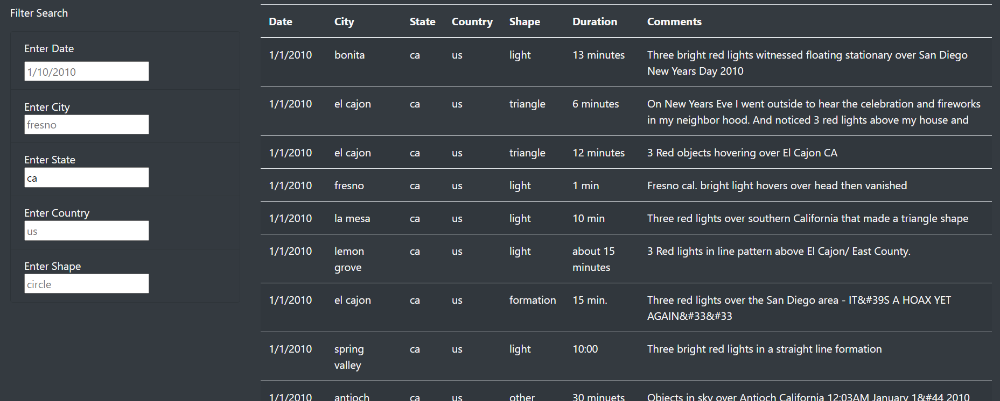
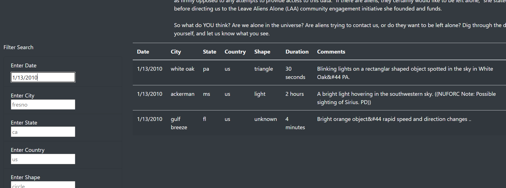
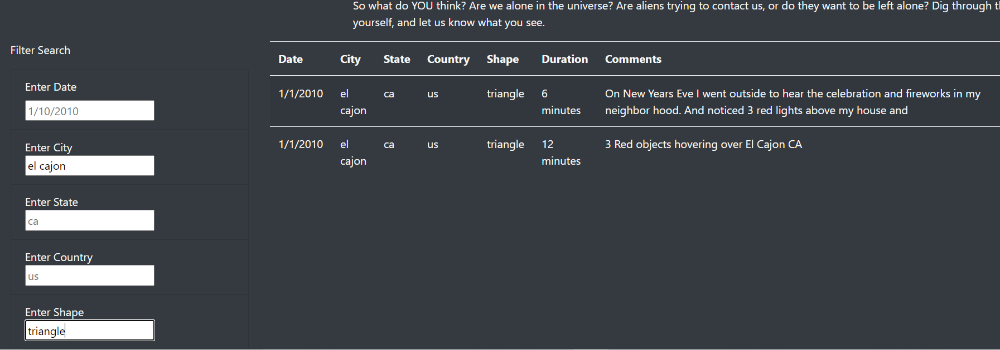

# Overview of project

In this challenge I have built a webpage and an interactive table to give the user access to UFO data.

# Results
This project consists of HTML file, app.js, style.css and data.js file.  All files put together result in an dynamic table that can be filtered to user's interests.
The table can be filtered by date, city, state, country and shape of UFO sighting data.  

In the image below the table is filtered by the "Enter State" button.  The entry is "ca" for California, just California, no other filters were used.

In this image below the table was filtered by the "Enter Date" button. The entry is 1/13/2010 and all the UFO sighting for that date are shown.

However not only one filter has to be entered, in the table below we can see that the table was filtered by "Enter Shape" and "Enter City" buttons.  

